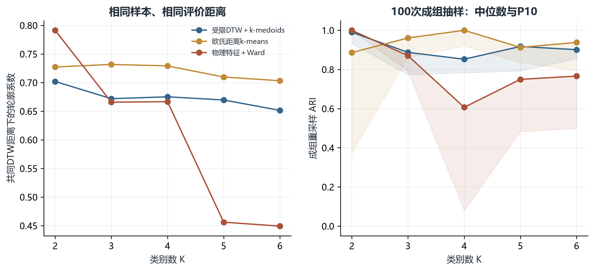
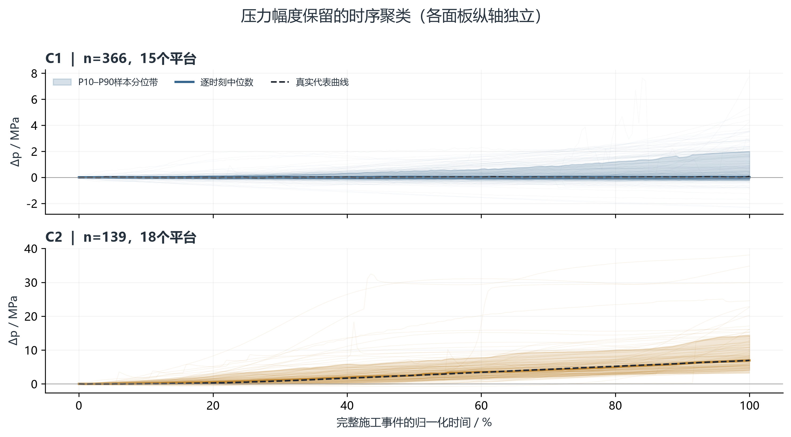

# 邻井压力时序聚类：首轮全数据探索结果

## 一、结论

本轮已完成对 **1,764 份监测文件、28 个目录平台**的读取检查，以及施工事件匹配、去重、质量控制、多方法比较和稳定性检验。

严格质量口径下，纳入 **505 条独立施工段—邻井响应，覆盖 19 个平台、90 个物理井对、226 个施工段组**。在本轮比较的算法及参数范围内，选定 **受限DTW＋k-medoids，K=2**。共同DTW轮廓系数为 **0.702**，100次成组重采样ARI中位数为 **0.990**，P10为 **0.931**。

本轮类别是压力曲线的统计分组，证据级别为“仅压力观测”。当前未进行微地震验证，不能将类别直接命名为已验证的流体连通机制、恶性压窜类型或安全等级。

## 二、数据范围及纳入情况

源数据：`E:/压裂窜扰项目/02 规范化`，递归检查各平台邻井压力目录，并包含“不重要的”子目录。示例模板目录“xxx平台”不计入研究数据。原始文件保持只读。

- 解析得到的压力通道记录：6,091。这一数量含重复导出、多工作表和低频记录，不能用作独立样本量。
- 未提取出可识别时序通道的文件：161，逐文件说明见过程目录的压力文件索引。
- 匹配施工后进入主分析的独立样本：505。
- 仅作补充复核的独立样本：793。
- 基线非平稳或近零压力跳变、需核实工况/仪表的独立样本：18，单列保存，不进入主聚类也不标为低风险。
- 匹配后因质量不足排除的独立样本：402。
- 匹配候选中重复导出或重复工作表：805。

上述文件、通道和独立样本是不同统计单位，不应直接相加。未匹配记录可能对应一个文件、一个压力通道或一个候选事件，明细中保留其粒度。

| 原因 | 记录数 |
|---|---|
| 无可唯一匹配施工事件 | 3405 |
| 未解析出压力通道 | 145 |
| 同名井段绝对日期不重叠 | 96 |
| 施工井自身压力通道 | 54 |
| 文件名平台与目录归属冲突 | 17 |
| 多源同期施工_归因不唯一 | 12 |
| 监测邻井同期施工 | 3 |

平台覆盖明细见 `11_平台覆盖汇总.csv`；全部候选曲线质量见 `01_全部候选曲线与质控.csv`。

## 三、处理与比较方法

1. 以“平台—施工井—施工段—监测邻井”为样本键；同段多个邻井共同归入施工段组。中间停泵保留在整段窗口内，本轮不将停泵后复施工拆成新的独立样本。
2. 按有效排量自动识别完整施工窗口：排量阈值为 max(0.5 m³/min, 该记录P95排量的5%)，有效段需持续至少60 s。使用首个与末个有效泵注区间界定窗口，优先选择采样更密的有效施工表。
3. 双方有绝对日期时按绝对时间匹配。对有绝对日期支持的监测邻井同期施工和多源施工重叠单独排除。只有时分秒、无法核实跨井同期作业的记录保留这一限制。同一已知井段只有时分秒时，仅按同名井段和时钟对齐，允许整日平移处理跨日，不移动起涨点、不做最大相关平移。主分析的对齐方式构成为：{'absolute': 311, 'named_stage_clock_only': 194}。时钟对齐样本仍需施工日志核实日期。
4. 起泵前10 min内至少5个有效点、覆盖180 s，取中位数作为基线。施工前基线不足时只生成“初始窗代理基线”的补充记录，不进入主分析。
5. 主分析要求施工窗首尾覆盖率≥95%、最大观测缺口≤30 s、原始采样间隔≤30 s；全零占位压力不纳入。起泵前P90-P10>1 MPa、末60 s中位压力与基线相差>0.5 MPa、或基线斜率绝对值>0.1 MPa/min者，列为基线非平稳待复核；原始压力出现<1 MPa且在≤5 s采样中有>5 MPa跳变者列为仪表/工况待复核。这些是本轮质量审查阈值，并不证明该响应虚假，也不能据此判为低风险。人工低频记录不会通过插值变成高频观测。
6. 原始尺度保留MPa和min。施工内使用约15 s中心中位滤波，随后在共同施工窗口内重采样为201点。保留压力涨幅而不逐条标准化，起涨时滞按 max(0.1 MPa,3倍基线稳健波动)持续60 s定义；未检出时保留删失标记。
7. 比较受限DTW＋k-medoids、欧氏k-means、物理特征＋Ward，每种K=2～6。DTW半径10点，距离为累计平方误差平方根再除以√201。Ward使用A60、终值、下降幅度、平均面积、一分钟最大涨速、相对时滞和删失标记的稳健缩放特征。
8. 所有方案用同一受限DTW距离矩阵计算共同轮廓系数。主要随机算法20次初始化；100次稳定性重拟合每次5次初始化。按平台分层，每次抽取约80%的施工段组，同段邻井不拆散；报告对全样本聚类的ARI和相邻重复共同样本上的ARI。
9. 先检查每类至少20个施工段、2个井对和2个平台的支持度，以及ARI-P10≥0.7；在通过的候选中选共同轮廓系数较高的方案，差值≤0.02时优先较少类别。若没有通过方案，则结果仅为探索性分型，不强行赋予成熟类型含义。

**当前支持度门槛通过：True；稳定性门槛通过：True。**

### 相对试验方案V2的本轮差异

本轮按本次“对现有全部曲线聚类”的任务开展全数据探索，尚未按D0/D1/D2封存外部平台。Soft-DTW k-means本轮未运行，以欧氏k-means作为时间不变形基线；因此不能声称已证明优于Soft-DTW。100次稳定性重拟合采用5次随机初始化，主比较为20次。采样间隔、基线阈值、起涨阈值等尚未全部穷尽敏感性组合。本轮可用于建立候选类型，论文中的最终独立测试仍需重新设计冻结发现集或使用后续新增平台。

## 四、算法比较结果

以下列出全部15个候选，选定方案置于首行；完整结果见 `03_算法与类别数比较.csv`。较高轮廓系数同时受类数和类间幅度分离影响，需结合支持度和稳定性解释。

| 方法 | K | 共同轮廓系数 | ARI中位数 | ARI-P10 | 支持度通过 | 选定 |
|---|---|---|---|---|---|---|
| 受限DTW＋k-medoids | 2 | 0.702 | 0.990 | 0.931 | True | True |
| 物理特征＋Ward | 2 | 0.791 | 1.000 | 1.000 | False | False |
| 欧氏距离k-means | 3 | 0.732 | 0.961 | 0.859 | False | False |
| 欧氏距离k-means | 4 | 0.729 | 1.000 | 0.920 | False | False |
| 欧氏距离k-means | 2 | 0.727 | 0.887 | 0.375 | True | False |
| 欧氏距离k-means | 5 | 0.710 | 0.913 | 0.835 | False | False |
| 欧氏距离k-means | 6 | 0.703 | 0.938 | 0.794 | False | False |
| 受限DTW＋k-medoids | 4 | 0.675 | 0.853 | 0.783 | False | False |
| 受限DTW＋k-medoids | 3 | 0.672 | 0.887 | 0.774 | True | False |
| 受限DTW＋k-medoids | 5 | 0.670 | 0.917 | 0.793 | False | False |
| 物理特征＋Ward | 4 | 0.667 | 0.607 | 0.079 | False | False |
| 物理特征＋Ward | 3 | 0.666 | 0.870 | 0.792 | False | False |
| 受限DTW＋k-medoids | 6 | 0.651 | 0.901 | 0.855 | False | False |
| 物理特征＋Ward | 5 | 0.456 | 0.749 | 0.483 | False | False |
| 物理特征＋Ward | 6 | 0.449 | 0.766 | 0.499 | False | False |

### 为什么没有只选轮廓系数最高的方案

物理特征＋Ward的K=2轮廓系数较高，但把仅5条曲线单独分成一类，未达到20个施工段的支持门槛。欧氏k-means的K=2在部分成组抽样中分组变化较大，ARI-P10约0.375。受限DTW的K=2兼顾了类别支持、稳定性与分离程度。DTW的K=3也通过门槛，但共同轮廓系数约0.672、稳定性低于K=2，因此保留为细分备选而不强行增加类别。

## 五、类别的实际响应特征

类别编号按A60中位数升序排列，编号顺序不等同于经验证的风险顺序。A60指完整60 s窗口内压力增量中位数的最大值。下表时滞只统计检出持续起涨的曲线；未检出数量和四分位范围保存在类别汇总表中。

| 类别 | 样本数 | 平台数 | 井对数 | 施工段数 | A60中位数(MPa) | 已检出时滞中位数(min) | A60≥5MPa比例(0–1) |
|---|---|---|---|---|---|---|---|
| C1 | 366 | 15 | 63 | 158 | 0.030 | 55.792 | 0.008 |
| C2 | 139 | 18 | 48 | 120 | 6.920 | 17.083 | 0.770 |

**暂定的描述名称**：C1为“微弱响应为主型”，C2为“持续增压为主型”。这两个名称描述当前类内多数曲线，不保证覆盖所有边界曲线。C1仍含少量晚期较大涨幅样本，所以C1不能整体等同于无压窜或低风险。C2内部也有不同上升形态，当前不足以分别定为不同连通机制。

逐条z-score后与主分型的ARI约0.037，说明“只比较形状”与“保留幅度”的分组差异很大。现有结果最稳健地支持强弱响应的粗分，不足以声称已发现多种独立、稳定的机制形态。泸201H5贡献242/505条主分析曲线，跨平台样本并不均衡；移除该平台后ARI约0.882，须在论文中同时披露。

各类代表样本来自真实观测，文件、井段、邻井和时间信息见 `07_类别响应特征汇总.csv` 及 `06_主分析样本聚类标签.csv`。1和5 MPa仅用于报告试验方案中的幅度组成，当前不构成通用压窜判据。

## 六、稳健性和边界样本

| scenario | method | k | ari_vs_selected | ari_vs_dtw_same_k | own_silhouette | common_original_dtw_silhouette |
|---|---|---|---|---|---|---|
| radius0 | DTW_kmedoids | 2 | 0.992 | 0.992 | 0.689 | 0.703 |
| radius5 | DTW_kmedoids | 2 | 0.984 | 0.984 | 0.695 | 0.702 |
| radius20 | DTW_kmedoids | 2 | 0.959 | 0.959 | 0.708 | 0.696 |
| length101 | DTW_kmedoids | 2 | 1.000 | 1.000 | 0.702 | 0.702 |
| per_curve_zscore | DTW_kmedoids | 2 | 0.037 | 0.037 | 0.612 | 0.088 |
| no_median_smoothing | DTW_kmedoids | 2 | 0.992 | 0.992 | 0.701 | 0.701 |

敏感性表固定选定类别数，并以DTW＋k-medoids检查时间约束、序列长度、逐条标准化及是否平滑的影响。其中逐条标准化回答“仅按形状分组是否一致”，与保留幅度的研究问题不同。

留一平台后，在其余样本上重新拟合的ARI范围为 **0.882～1.000**。这是类型发现对平台构成的敏感性检查，不是监督分类模型的外部预测性能。

按前两类原型距离差占第二近距离的比例<0.1标记边界样本，比例为 **2.0%**。最近真实原型重分配与原聚类标签的一致率为 **100.0%**；若采用Ward或k-means，后续冻结字典时必须保留这一赋值差异。补充曲线的临时归类只作复核，不能直接混入正式训练标签。

## 七、论文中可以写到什么程度

可以报告本轮数据覆盖、明确的纳入排除流程、三方法的共同距离评价、K选择依据、真实代表曲线及稳定性。样本来自已有监测资料，可能偏向曾被关注或已出现异常的井段，类别比例不代表全区块压窜发生率。

当前不能写为已验证的机制分型、地质因素因果效应或施工前预测能力。微地震、天然裂缝参数提取、分类预测与SHAP均未在本轮执行。任何仅由压力指标定义的等级与压力指标的差异，属于描述而非独立验证。

下一步应先结合真实代表曲线和边界样本核实井号、基线与施工工况，确定候选类型名称，再按用户计划进入微地震处理与独立验证。

## 八、交付文件与复算

结论目录包含本报告、CSV结果表，以及300 dpi PNG、矢量PDF和SVG图件。代码、源文件哈希索引、原始尺度片段、201点矩阵、距离矩阵、抽样分组、配置和环境版本全部保存在同名“过程”目录。

源文件未被写入、移动或删除。结果标签文件带有原始文件路径、压力工作表、施工工作表和样本键，可逐条追溯。

### 方法资料

- [DTW时序聚类原理与实现说明](https://tslearn.readthedocs.io/en/stable/user_guide/clustering.html)
- [scikit-learn 轮廓系数定义](https://scikit-learn.org/stable/modules/generated/sklearn.metrics.silhouette_score.html)
- [scikit-learn ARI定义](https://scikit-learn.org/stable/modules/generated/sklearn.metrics.adjusted_rand_score.html)

## 九、最终核验与标签使用

- 独立抽查12对曲线，DTAIDistance与tslearn实现的同半径DTW距离完全一致。
- 去重样本键、矩阵数值、标签覆盖、类别计数及主分析质量阈值检查均通过。监测源文件的大小与修改时间保持一致。
- 将最后一条近零压力大跳变记录移入工况复核后，其余505条曲线的分组与修订前完全一致（共同样本ARI=1.000）。
- 10条曲线属于原型距离边界样本；另有2条在成组抽样中的标签一致率低于80%。两种标记含义不同，逐样本结果见 `13_逐样本重采样一致性.csv`。
- 同一施工段的多个邻井可能分入不同类别，因此各类别的施工段数、井对数不能简单相加作为总数。
- 输出属于首轮探索标签，尚未经盲审命名、微地震验证或独立外部平台检验。本轮未运行地质分类预测和SHAP。
