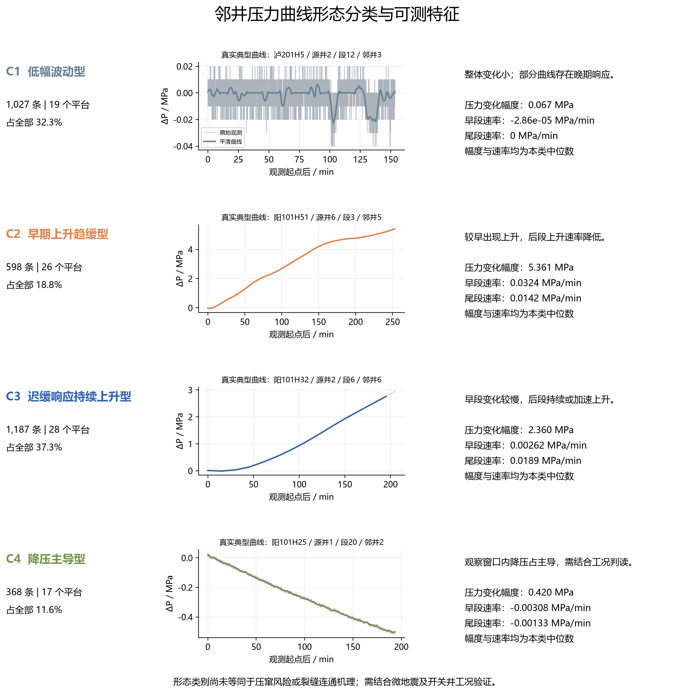
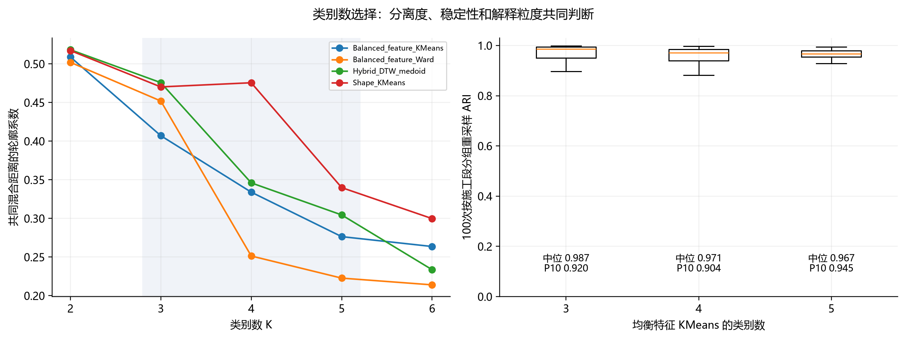

# 邻井压力时序聚类：V2 全量利用与四类形态结果

## 1. 本轮结论

本轮逐一读取 **1,764 个监测目录文件**，最终获得 **3,180 条去重后的压力曲线观测**，覆盖 **28 个来源平台**。相对首轮505条严格主分析样本，扩大至 **6.30倍**。两轮纳入标准不同，这不是简单新增独立压窜事件数。

建议论文的**当前形态解释采用四类**：低幅波动、早期上升趋缓、迟缓响应持续上升、降压主导。这里的“迟缓”主要是观测窗口内的相对描述。四类是分离度与物理可解释粒度的折中，不是统计指标的全局最优解，也不是已经验证的风险等级。

| 类别 | 曲线数 | 幅度中位数/MPa | 早段速率/MPa·min⁻¹ | 尾段速率/MPa·min⁻¹ |
|---|---|---|---|---|
| C1 低幅波动型 | 1027 | 0.067 | -0.0000 | 0.0000 |
| C2 早期上升趋缓型 | 598 | 5.361 | 0.0324 | 0.0142 |
| C3 迟缓响应持续上升型 | 1187 | 2.360 | 0.0026 | 0.0189 |
| C4 降压主导型 | 368 | 0.420 | -0.0031 | -0.0013 |

变化幅度定义为平滑压力的P95−P05；早段和尾段分别为观察窗口前25%及后25%的回归斜率。单位为MPa与MPa/min。统计为全类中位数，不是判定阈值。

## 2. 为什么首轮没有用上部分数据

首轮以可靠的施工起点、至少180秒施工前基线、较高时间覆盖度、较小采样间隔和缺口为主要门槛，适合对齐后的强度比较，却不适合作为全部形态数据的唯一入口。例如528条候选仅因施工前基线不足被放入补充组。重复导出也不应重复计数。

本轮改进：

- 合并新旧解析器，补充中文井号、TimeStamp、日期时间分列、No/通道编号、ch通道字典、多井分组表头和跨平台监测身份识别。
- 原始数据不移动、不删除。重复且一致的记录合并；不同读数的同事件记录保留并标记，避免强行拼接。
- 缺少施工前基线时，用观察起点邻域压力作参考，仍参与形态聚类；标签表明确记录参考方式。
- 低频记录保留整体变化趋势；不把插值生成的点当成新增观测。
- 长缺口曲线仅回收具有至少6点、至少5分钟、最长18小时的最长可解释连续片段；余下片段没有被自动解释为完整施工事件。
- 排除明确的施工井自身压力、砂浓/排量等非压力变量、阶段汇总指标、全零占位和无法可靠构造时序的记录。

### 本轮利用口径

- 至少成功提取压力通道的文件：**1727 / 1764**；实际关联到最终样本或其一致重复记录的文件：**1662 / 1764**。
- 可用曲线：**3180条**，其中低频记录（原生间隔>120秒）**998条**、局部连续片段 **54条**。
- 同事件读数不一致标记：**224条**；源井或段号未明确：**460条**；监测井身份未明确：**22条**；近零压力大跳变工况标记：**22条**。这些集合可以重叠，不能相加。
- 文件窗口 1382条；依段号和时钟匹配施工窗口 1009条；日期时间匹配施工窗口 789条。后两类也受原始记录真实性及多井同时施工影响，不自动视为因果证据。

**“全部利用”在这里是全量扫描、尽量提取、逐项说明去向；并非把所有文件都强行变成样本。** 未使用数据和重复记录的准确去向见[每个文件最终利用清单](12_每个文件最终利用清单.csv)、[逐通道审计](03_逐通道利用去向.csv)、[剩余未用原因](13_剩余未用记录原因.csv)。工作表层面的多轮补读审计保存在02系列CSV。

## 3. 分类依据和算法设计

每条曲线保留实际压力、原生时间、采样分辨率与来源。处理顺序为时间去重与排序、有限缺口插值、原生或更粗时间尺度平滑、101点相对时间表示、特征提取。

1. **形态块（60%）**：10/25/50/75/90%时刻相对压力、终点值、早中尾段归一化斜率、初始下探、回落程度、峰谷位置、观察窗口内响应位置。形态归一化分母取P95−P05、0.2 MPa和3倍噪声估计三者最大值，避免把微弱噪声放大。
2. **幅度块（25%）**：压力范围、相对起点最大上升/下降、尾端相对参考基线压力；带符号log1p变换。
3. **动力学块（15%）**：早中尾段MPa/min速率、早尾段斜率差除以时间间隔。分别采用0.01 MPa/min和0.0001 MPa/min²尺度做带符号log1p变换。
4. 各块用总体P10–P90稳健尺度并截断至±3，再按特征数量归一化、乘块权重的平方根。

用户提出的起始/尾端涨幅、速率、加速度和响应时间均有对应导出字段。瞬时加速度分位数另行导出供审查，**没有把不同采样频率下的瞬时加速度直接混入主模型**。主模型采用跨早尾段的加速趋势，适合当前混合采样频率。观察窗内响应位置包含右删失标记；未超过噪声阈值不等于真实无响应。

对比 **均衡特征KMeans、均衡特征Ward、形态KMeans、形态DTW与特征混合距离K-medoids**，各自K=2～6，共20个方案。DTW采用51点、±5点约束；共同评价距离为中位距离归一化后的50%形态DTW与50%均衡特征欧氏距离。轮廓系数在固定随机抽取的1600条曲线上计算，各方案使用同一批点。最终模型使用全部曲线。

## 4. 为什么推荐四类，而不是强行五类

- **三类**主要区分上升、低幅和下降，上升组里不同起涨与尾端速率仍被合并。
- **四类**进一步区分“早升后缓”和“迟缓但持续上升”，回应了时序形态的解释目标。
- **五类**的主要增量是把持续上升曲线按幅度继续细分；其标签已完整保存在候选标签文件中，可作为论文补充结果。当前不能据此声称得到五种独立压窜机理。
- 某些纯形态方案出现很小的突变曲线组，因此不能只看较高的轮廓系数。

所选四类的共同距离轮廓系数为 **0.334**。100次分平台、按施工段整体抽取80%组的重采样中，ARI中位数 **0.971**、第10百分位 **0.904**。ARI衡量重新拟合后分组的一致性，不是预测准确率，更不是风险识别正确率。

[全部20个候选方案](05_算法与类别数比较.csv)；[100次分组重采样](07_100次施工段分组稳定性.csv)。同一施工段及同段的冲突导出作为组保留，避免单条曲线随机拆分夸大稳定性；未知事件只能按平台及记录日粗分组。KMeans重采样时重新估计特征尺度；混合DTW模型的筛选稳定性以全量距离尺度为条件。

## 5. 质量敏感性与解释边界

| 检验 | 保留观测数 | ARI |
|---|---|---|
| 去除低频记录 | 2182 | 0.921 |
| 去除操作突变标记 | 3158 | 0.961 |
| 去除重复记录冲突 | 2956 | 0.935 |
| 去除局部片段 | 3126 | 0.978 |
| 仅日期可靠施工窗口 | 789 | 0.768 |
| 仅已知源井和段号 | 2720 | 0.994 |
| 形态权重_0.4 | 3180 | 0.654 |
| 形态权重_0.5 | 3180 | 0.792 |
| 形态权重_0.7 | 3180 | 0.876 |

**权重敏感性需特别注意：形态权重由60%降至40%时，ARI为0.654；降至50%为0.792，升至70%为0.876。这说明四类边界依赖预设的形态/幅度权衡，不能宣称对特征权重不敏感。**

留一平台检验（仅对样本≥20的平台）ARI范围 **0.902～0.995**。这些检验衡量当前形态划分对样本构成的敏感性，不是外部平台验证。

**340条曲线被标为分类边界**：分组重采样标签一致率<80%，或共同距离轮廓系数<0。全部仍有标签，后续建立地质工程预测模型时，应先核查边界、工况、事件对应与监测井身份，不能把所有自动标签当成无误差真值。

- 四类是形态标签，不能直接对应高/中/低风险；C1低幅和C4降压也不能直接解释为无压窜。
- 没有可靠施工起点时，只能计算观测起点后的相对响应时间。依时钟匹配的记录不能提供独立可靠日期证据。
- 不同采样分辨率可能影响微幅组与降压组占比；原生间隔、平滑尺度和质量标志已逐条导出。
- 形态名称不是对所有成员的严格规则；每类内部仍有幅度和工况差异。
- 初降后升可作为附加描述字段进行核查，当前聚类没有证明其能独立形成稳定、充足的第五类。
- 微地震、裂缝逼近角和长度、地质工程预测、SHAP均尚未在本轮执行；不得把特征热图写成SHAP重要性。
- 本轮按用户要求使用全量探索数据，没有保留用于声称外部泛化的独立盲测集；后续预测模型应按平台或施工井组划分训练/验证集。

## 6. 可用于论文的结果表述

> 对监测目录内全部文件进行逐文件读取、通道识别与质量审查后，共形成3180条可辨认的邻井压力曲线观测。通过综合压力变化幅度、分段变化速率、相对起涨位置与曲线形态，对四种聚类方法及2～6个类别进行对比。兼顾样本支持度、重采样稳定性与解释粒度，采用均衡特征KMeans的四类结果作为当前形态描述方案，得到低幅波动型、早期上升趋缓型、迟缓响应持续上升型和降压主导型。四类结果在施工段分组重采样中的ARI中位数为0.971。该分类反映压力动态响应差异，尚需结合微地震与生产操作记录验证其与裂缝连通及压窜风险的对应关系。

## 7. 交付文件与复算

- [所有20个方案的逐曲线标签](14_全部候选方案逐曲线标签.csv)
- [响应时间适用性审查](15_响应时间适用性审查.csv)：只有201条同时具有日期匹配、稳定基线、至少95%施工覆盖且检测到响应；其他延迟值不能作为已核实真实响应时间。
- [全量标签与质量字段](08_全量曲线聚类标签.csv)
- [四类特征汇总](11_四类形态特征汇总.csv)
- [真实典型曲线索引](09_真实典型曲线索引.csv)
- [本地逐曲线查询页面](全量曲线查询.html)：搜索平台/井段/文件，查看每条压力曲线和来源。
- 图目录提供6组PNG/PDF/SVG；逐平台全曲线目录保留每个平台的全部曲线形态面板。
- 全部代码、中间数组、原生曲线、模型和缓存：`F:\论文库\IGS\实验\过程\时序聚类_V2_20260915`。
- 复算顺序和字段定义见过程目录的`复算说明.md`；原始E盘源文件只读。

## 方法资料

- [scikit-learn：聚类方法及评价](https://scikit-learn.org/stable/modules/clustering.html)
- [tslearn：时序聚类与DTW](https://tslearn.readthedocs.io/en/latest/user_guide/clustering.html)
- [SciPy：Savitzky–Golay滤波](https://docs.scipy.org/doc/scipy/reference/generated/scipy.signal.savgol_filter.html)

以上资料用于方法说明；本报告数值均来自本地实际数据运算。方案文档和示例图作为研究意图参考，其机理与措施未被当成已证实结论。

## 最终核验

1,764个原始文件的大小与修改时间均未变；抽查20个文件SHA256均一致。独立实现复核12对DTW距离误差为0；抽查24条曲线的幅度与早段斜率误差均小于1e-9。样本ID唯一、类别计数合计3180、特征矩阵与样本对应关系通过核验。详细记录见过程目录validation_checks.json。此为计算与来源完整性检查，不代表每一条原始记录均已经人工审阅。
