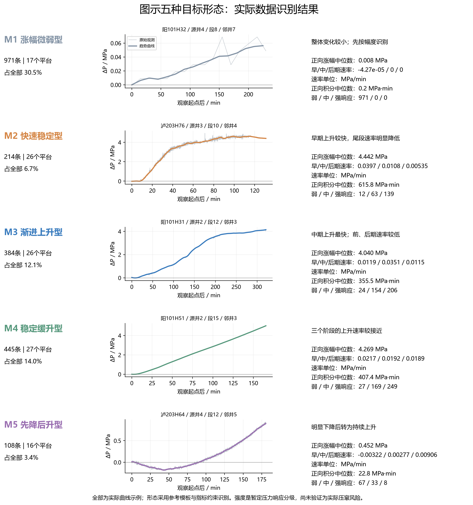
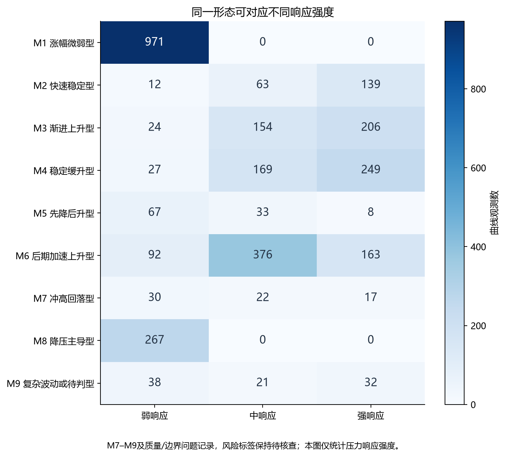
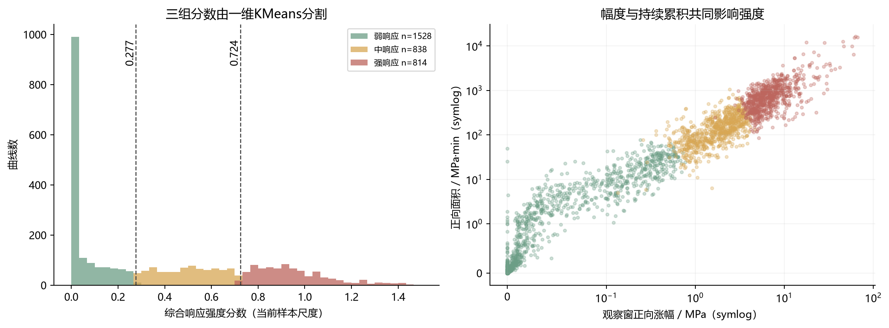

# V3：参考形态分类与强、中、弱响应分级

## 结论

**可以按图中的思路分类。本轮已在全部3180条曲线观测上完成重算，识别出五种目标形态，并保留实际数据中的额外形态。** 推荐采用“曲线形态 × 响应强度”的两层标签。当前强、中、弱描述压力响应，只有完成微地震、实际压窜及工况验证后，才能标定为风险等级。

这里使用的是**参考形态约束分类**：先定义图中要研究的形态家族，再由可计算指标和曲线拟合确定所属类型。它与完全无监督聚类不同，不能在论文中写成“算法无先验地发现了图示五种机理”。

图中典型曲线是按低拟合误差、身份可追溯及形态清楚程度选取的实际示例，不是每类的中位曲线；图右侧统计来自该类全部成员。M1示例显示微弱非零涨幅，M3示例突出中期速率峰值，M5示例显示超过0.15MPa的初始下降。全部曲线分布另见图06。

## 1. 实际分类结果与多对一映射

| 类型 | 数量 | 弱响应 | 中响应 | 强响应 |
|---|---|---|---|---|
| M1 涨幅微弱型 | 971 | 971 | 0 | 0 |
| M2 快速稳定型 | 214 | 12 | 63 | 139 |
| M3 渐进上升型 | 384 | 24 | 154 | 206 |
| M4 稳定缓升型 | 445 | 27 | 169 | 249 |
| M5 先降后升型 | 108 | 67 | 33 | 8 |
| M6 后期加速上升型 | 631 | 92 | 376 | 163 |
| M7 冲高回落型 | 69 | 30 | 22 | 17 |
| M8 降压主导型 | 267 | 267 | 0 | 0 |
| M9 复杂波动或待判型 | 91 | 38 | 21 | 32 |

五种目标类型合计 **2122条**；后期加速型等额外记录保留独立去向。所有3180条均有结果，包括复杂待判记录，未因不符合示例形态而删除。

同一形态出现多种强度，说明仅凭形态名字推断风险会损失信息。例如稳定缓升型中，强响应 **249条**，通常具有更大的涨幅或更长的持续累积；先降后升型也并非必然属于强风险。

## 2. 指标体系

令P0为本条观察窗起始5%邻域的压力中位数，ΔP(t)=P(t)−P0，T为实际观察时长。统一采用起点参考便于比较缺少施工前基线的曲线；它反映观察窗内变化，可能低估记录开始前已经发生的响应。原先基于施工前基线的指标仍保留，不能混淆两种口径。

| 指标 | 定义 | 单位 |
|---|---|---|
| 正向涨幅 | max(P95[P(t)−P0],0) | MPa |
| 变化幅度 | P95[P(t)]−P05[P(t)] | MPa |
| 整体回归涨幅速率 | 全观察窗口压力对时间的最小二乘斜率 | MPa/min |
| 端点平均涨幅速率 | 尾段压差/观察时长 | MPa/min |
| 前期速率 | 观察窗前1/3线性回归斜率 | MPa/min |
| 中期速率 | 观察窗中1/3线性回归斜率 | MPa/min |
| 后期速率 | 观察窗后1/3线性回归斜率 | MPa/min |
| 前中期加速度趋势 | (中期速率−前期速率)/(T/3) | MPa/min² |
| 中后期加速度趋势 | (后期速率−中期速率)/(T/3) | MPa/min² |
| 瞬时加速度P95 | 在原生或更粗时间上差分，不以插值增多点估计 | MPa/min² |
| 正向积分面积 | 积分max(P(t)−P0,0)dt，时间为分钟 | MPa·min |
| 有符号积分面积 | 积分(P(t)−P0)dt | MPa·min |
| 时长归一化正向面积 | 正向积分/T | MPa |
| 累计上涨时间 | 至多21点趋势中，增量>max(0.01MPa,噪声)的区间时长之和 | min |
| 最长连续上涨时间 | 连续满足上涨条件的最长区间时长 | min |
| 压力持续高于起点时间 | 趋势区间中点压差>max(0.05MPa,3×噪声)的时间 | min |
| 相对起涨位置 | 观察窗内首次连续两点超过噪声阈值的位置；未检出另有删失标记 | 0–1 |

前、中、后期统一按**观察窗三等分**，与V2的前25%/中50%/后25%不同。所有速度、加速度和积分使用实际分钟尺度。整体斜率和端点平均速率都已导出；前10%和后10%速率另存用于检查起始和尾端。

形态曲线按max(P95−P05, 0.2MPa, 3倍噪声)归一化。趋势平滑在V2原生或更粗尺度上进行，窗口约为max(3分钟,观察时长5%)，不把101点插值当作新增观测。998条原生采样间隔>120秒的记录仍可用于总体趋势，但瞬时加速度精度有限。

“累计上涨时间”“最长连续上涨时间”和“压力高于起点的持续时间”是不同指标：压力进入平台时可能不再上涨，却仍维持高压力。强度分级同时考虑这种区别。持续时间采用至多21个趋势点估计，不声称亚采样间隔精度。

## 3. 图示形态如何被识别

| 类型 | 判据 | 解释边界 |
|---|---|---|
| M1 涨幅微弱 | 变化幅度≤0.2MPa且最大正向涨幅≤0.3MPa；优先识别 | 0.2MPa为探索性规则，已检验0.1–0.3MPa |
| M2 快速稳定 | 前期归一化斜率>0.25；后期斜率<前/中期较大值的55%；拟合早期饱和曲线 | “稳定”指后段相对趋缓，不要求严格水平 |
| M3 渐进上升 | 中期斜率>前/后期较大值的1.15倍；拟合S形曲线 | 前中期加速、中后期减速 |
| M4 稳定缓升 | 各阶段持续上升，与直线模板更接近 | “缓”是相对形态描述，不能据此定为弱响应 |
| M5 先降后升 | 下降超过max(噪声阈值,幅度尺度8%)；谷值在观察窗2.5–65%；随后充分回升 | 初降必须超过可辨认噪声 |
| M6 后期加速 | 后期斜率>前期斜率的1.25倍，拟合延迟幂函数上涨 | 保留尚未进入后期平台的形态 |
| M7 冲高回落 | 峰值出现在窗内，回落比例>30%，尾段斜率为负 | 风险映射保持待核查 |
| M8 降压主导 | 尾端压差明显为负，正向上涨有限 | 不能把降压直接解释为无压窜 |
| M9 复杂/待判 | 形态条件均不满足或归一化拟合RMSE>0.30 | 不强制归入理想形态 |

对非微弱曲线，在通过指标约束的家族内比较直线、早期指数饱和、S形、初降再上升、延迟幂函数、冲高回落和下降模板。拟合允许非负幅度缩放与常数偏移，最小化归一化残差，并施加每形状参数0.0006的复杂度惩罚，避免更灵活模板无条件胜出。网格参数、候选误差及选中模板逐条保存在过程目录。

**636条标为形态边界/待核查**：拟合误差偏大、两种类型拟合接近、参数敏感或无法用单一模板解释。保留自动标签，同时标明不确定性，不把它们当作无误差真值。

### 自由聚类对照

在新增指标空间另行运行KMeans的5～9类方案。当前K=6的轮廓系数最高，但其分组与目标形态分类的ARI仅约0.42～0.45。这表明单纯自由聚类仍会混合形态与幅度差异，不能保证直接复现图中的命名体系。

| 类别数 | 轮廓系数 | 最小类数量 | 分组重采样ARI中位数 | 与参考分类ARI |
|---|---|---|---|---|
| 5 | 0.278 | 408 | 0.969 | 0.421 |
| 6 | 0.283 | 289 | 0.953 | 0.442 |
| 7 | 0.28 | 163 | 0.973 | 0.448 |
| 8 | 0.266 | 162 | 0.958 | 0.442 |
| 9 | 0.273 | 163 | 0.922 | 0.422 |

自由聚类稳定性使用30次按平台分层、施工段整体抽取80%的重采样，特征尺度固定于全量数据，属于当前尺度条件下的结果；轮廓系数使用同一固定1600条随机样本。参考模板分类使用规则/平滑敏感性检验，不能用固定规则重复预测制造“100%稳定性”。

## 4. 强、中、弱如何确定

**形态标签不直接决定风险。** 对每条曲线，用六项单调增加的响应指标构成探索性强度分数：

- 正向涨幅：35%。
- 时间归一化正向面积：20%。
- 正向累计面积：10%。
- 高于起点的持续时间：10%。
- 累计上涨时间：5%。
- 前、中、后期最大正向速率：20%。

各指标先按固定物理尺度log1p变换，再除以当前样本P90并截断至1.5；保留各分量与贡献，能够逐条解释分数。面积、涨幅和时长有关联，因此用较小的累计面积/时长权重，并用去除累计量的替代权重检查重复计权影响。加速度趋势用于形态判定；没有把采样分辨率差异很大的瞬时加速度直接用于强度打分。

对强度分数进行一维KMeans三组划分，按组中心由小到大命名。当前分界为 **0.2769、0.7243**，得到弱响应 **1528条**、中响应 **838条**、强响应 **814条**。这些分界是本批数据下的探索性分界，**不是工程安全阈值，也不是MPa阈值**。

所有曲线都有计算响应等级。但 **1485条的风险标签保持“待核查”**，涉及下降/回落/复杂形态、分类边界、身份不清、片段、冲突、操作突变或权重敏感；不能因为算出的正向涨幅小就直接标成低风险。其余1695条可作暂定风险标签候选，仍需要独立证据验证。

## 5. 稳健性与局限

### 形态参数敏感性

| 改变条件 | 同标签比例 | ARI |
|---|---|---|
| 微弱幅度界限_0.1MPa | 0.9138 | 0.7891 |
| 微弱幅度界限_0.15MPa | 0.972 | 0.9261 |
| 微弱幅度界限_0.25MPa | 0.9711 | 0.9236 |
| 微弱幅度界限_0.3MPa | 0.9481 | 0.8653 |
| 每参数惩罚_0.0003 | 0.9767 | 0.9595 |
| 每参数惩罚_0.0012 | 0.9557 | 0.9217 |
| 趋势平滑尺度_0.5 | 0.9965 | 0.9926 |
| 趋势平滑尺度_2.0 | 0.995 | 0.9916 |

### 强度分级敏感性

| 替代方案 | 记录数 | 同等级比例 | ARI | 弱 | 中 | 强 |
|---|---|---|---|---|---|---|
| 等指标权重 | 3180 | 0.9302 | 0.8159 | 1403 | 930 | 847 |
| 幅度优先 | 3180 | 0.9786 | 0.9424 | 1559 | 812 | 809 |
| 持续时间面积优先 | 3180 | 0.9575 | 0.8891 | 1494 | 889 | 797 |
| 无累计面积时长 | 3180 | 0.9258 | 0.8103 | 1673 | 768 | 739 |
| 排除操作突变 | 3158 | 0.9984 | 0.9965 | 1525 | 827 | 806 |
| 排除低频 | 2182 | 0.9555 | 0.8774 | 845 | 662 | 675 |
| 排除片段和冲突 | 2908 | 0.9842 | 0.9579 | 1398 | 769 | 741 |

这些比例衡量参数变化后的结果一致性，不是分类准确率。形态阈值、模板网格及权重是本轮明确公开的设计选择，尚未经过独立人工标签或微地震证据校准。可先作为论文的候选方法，后续冻结参数再做独立验证。

- 本轮沿用V2的全量3180条可辨认观测及其去重、片段、源文件身份审计，没有重新定义独立压窜事件数。
- 观察窗可能缺少早期或尾部。晚起记录会把“渐进”看成“稳定”，尚未观测到平台的S形可能被归为“后期加速”。
- 响应“强”不必然等于损害“重”；井筒容积、井口开关状态、压力恢复、注采工况等也影响压力。
- 初降后升不能仅凭曲线证明“应力激活天然裂缝”；快速稳定也不能单独证明“压裂缝直接沟通”。
- 图中的液强、排量、段长等措施参数未沿用，没有足够证据据此给出施工建议。

## 6. 后续风险验证怎么接

建议后续使用两套标签：**M1–M8形态标签（M9待判）**与**弱/中/强暂定响应等级**。用微地震连通性、距邻井最近事件/裂缝距离、裂缝逼近角、实际压窜记录和操作日志，核查“不同形态与强度组合是否对应不同风险”。验证后再生成正式风险标签。

地质工程预测模型可分别预测形态与风险，或优先预测最终验证后的三类风险；同一施工段的邻井曲线必须成组划分训练/验证集，避免泄漏。SHAP用于解释地质工程参数与已验证标签的关系，不能用本轮人工加权分数的分量贡献冒充SHAP。

## 7. 文件

- [全量形态与强度标签](01_全量曲线形态与强度标签.csv)
- [形态×强度交叉表](02_形态与强度交叉表.csv)
- [各类指标汇总](03_形态特征汇总.csv)
- [指标定义](09_指标定义.csv)与[明确判据](10_形态判定规则.csv)
- [自由聚类对照标签](06_自由聚类逐条标签.csv)
- [典型曲线原始来源](08_典型曲线来源.csv)
- 图目录提供6组PNG、PDF、SVG。
- 过程目录：`F:\论文库\IGS\实验\过程\时序聚类_V3_形态与强度`；代码顺序为01_classify.py、02_validate_models.py、03_report.py。V2和原始数据保留。

**本轮可以作为“参考形态约束分类＋响应强度分级”的候选方法与结果交付；不能作为已经验证的三类压窜风险结论。**

## 计算核验

3180条样本ID唯一，形态×强度交叉表合计3180。全量正向积分以逐梯形求和独立复核，最大误差为0；适用记录的前期斜率以独立拟合复核，最大误差小于1e-12。八种已知数学形态的判定测试全部通过；这些是代码测试，不是实际曲线分类准确率。核验记录位于过程目录validation.json与controlled_shape_tests.json。六组PNG图均经视觉检查，提供相应PDF和SVG。
